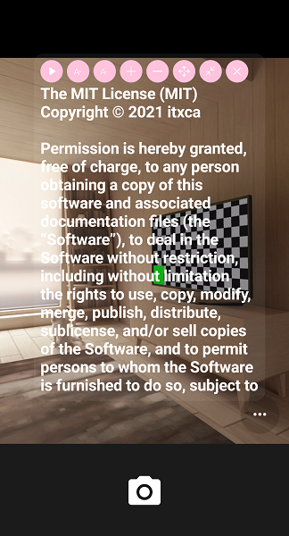

[](https://android-arsenal.com/api?level=23)
[](https://opensource.org/licenses/MIT)


## PromptX

一个简单的提词器。

> 别问为什么那么粉，问就是LD需要。

- [x] 悬浮题词
- [x] 字体大小、颜色、悬浮窗背景、题词速度
- [x] 自动识别复制文本
- [ ] 集成第三方朗读识别做文字跟随滚动

---
### Screenshots


******



---
### Thanks

- [EasyFloat](https://github.com/princekin-f/EasyFloat)
- [BasePopup](https://github.com/razerdp/BasePopup)
- [BRV](https://github.com/liangjingkanji/BRV)
- [Serialize](https://github.com/liangjingkanji/Serialize)
- [ColorPickerView](https://github.com/skydoves/ColorPickerView)
- [AndroidUtilCode](https://github.com/Blankj/AndroidUtilCode)

---
### License

```
MIT License

Copyright (c) 2021 TxcA

Permission is hereby granted, free of charge, to any person obtaining a copy
of this software and associated documentation files (the "Software"), to deal
in the Software without restriction, including without limitation the rights
to use, copy, modify, merge, publish, distribute, sublicense, and/or sell
copies of the Software, and to permit persons to whom the Software is
furnished to do so, subject to the following conditions:

The above copyright notice and this permission notice shall be included in all
copies or substantial portions of the Software.

THE SOFTWARE IS PROVIDED "AS IS", WITHOUT WARRANTY OF ANY KIND, EXPRESS OR
IMPLIED, INCLUDING BUT NOT LIMITED TO THE WARRANTIES OF MERCHANTABILITY,
FITNESS FOR A PARTICULAR PURPOSE AND NONINFRINGEMENT. IN NO EVENT SHALL THE
AUTHORS OR COPYRIGHT HOLDERS BE LIABLE FOR ANY CLAIM, DAMAGES OR OTHER
LIABILITY, WHETHER IN AN ACTION OF CONTRACT, TORT OR OTHERWISE, ARISING FROM,
OUT OF OR IN CONNECTION WITH THE SOFTWARE OR THE USE OR OTHER DEALINGS IN THE
SOFTWARE.
```